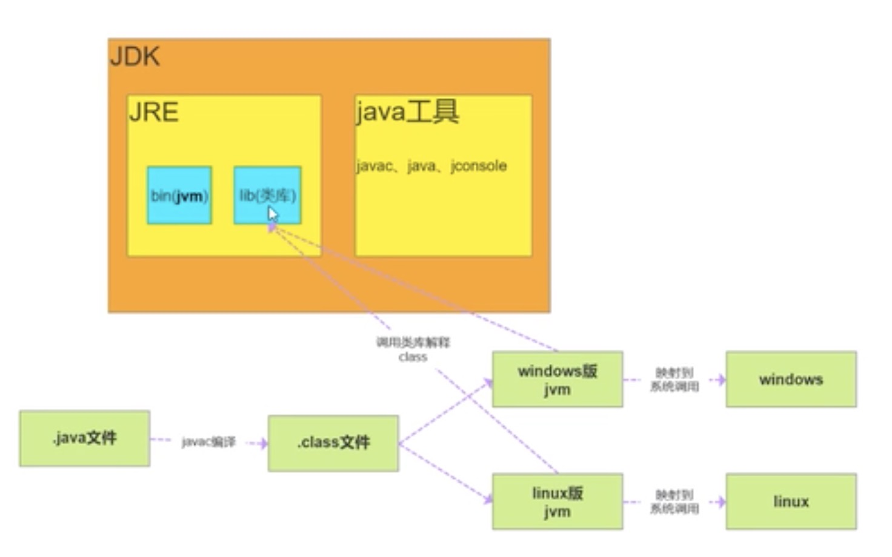

[TOC]

## Java基础

### 1.什么是面向对象？谈谈你对面向对象的理解  
什么是面向对象？  
对比面向过程，是两种不同处理问题的角度。
面向过程更注重事情的每一步骤及顺序，面向对象更注重事情有哪些参与者（对象）以及各自需要做什么   
比如：洗衣机洗衣服  
面向过程会将任务拆解成一系列的步骤（函数），1.打开洗衣机--->2.放衣服--->3.放洗衣粉--->4.清洗--->5.烘干  
面向对象会拆出人和洗衣机两个对象：  
人：打开洗衣机 放衣服 放洗衣粉  
洗衣机：清洗 烘干  

从上面的例子可以看出，面向过程比较直接高校，而面向对象更易于复用、维护和扩展  

**面向对象**  
**封装：** 封装的意义，在于明确标识出允许外部类使用的所有成员函数和数据项，内部细节对外部调用透明，外部调用无需修改或者关系内部实现。  

1.JavaBean的属性私有，提供getset对外访问，因为属性的赋值或者获取逻辑只能由JavaBean本身决定，而不能由外部胡乱修改。

```java
private String name;
public void setName(String name){
  this.name = "tuling_"+name;
}
//该name有自己的命名规则，明显不能由外部直接赋值
```

2.orm框架 操作数据库，我们不需要关心链接是如何建立的、sql是如何执行的，只需要引入mybatis，调用方法即可。 

**继承：** 继承基类的方法，并做出自己的改变或扩展。  

子类共性的方法或者属性直接使用父类的，而不需要自己再定义，只需要扩展自己个性化的。  

**多态：** 基于对象所属类的不同，外部对同一个方法的调用，实际执行的逻辑不同。  

多态条件：继承、方法重写、父类引用指向子类对象。 

```java
父类类型 变量名 = new 子类对象;
变量名.方法名();
```

**无法调用子类特有的功能**。    

### 2. JDK、JRE、JVM三者的区别和联系

JDK：Java Development Kit Java开发工具  

JRE：Java Runtime Environment Java运行时环境   

JVM：Java Virtual Machine  Java虚拟机   



### 3.==和equals

==对比的是栈中的值，基本数据类型是变量值，引用类型是堆中内存对象的地址  
equals：object中默认也是采用==比较，通常会重写   

### 3、简述final的作用，为什么局部内部类和匿名内部类只能访问局部final变量
**final**  
- 修饰类：表示类不可被继承  
- 修饰方法：表示方法不可被子类覆盖，但是可以重载  
- 修饰变量：表示变量一旦被赋值就不可以更改它的值  
1）修饰成员变量  
- 如果final修饰的是类变量，只能在静态初始化块中指定初始值或者声明该类变量时指定初始值  
- 如果final修饰的是成员变量，可以在非静态初始化块、声明该变量或者构造器中执行初始化值  
2）修饰局部变量  
系统不会为局部变量进行初始化，局部变量必须由程序员显示初始化，因此final使用final修饰局部变量时，既可以在定义时指定默认值（后面的代码不能对变量再赋值），也可以不指定默认值，而在后面的代码中对final变量赋初值（仅一次）  

```java
public class FinalVar{
    final static int a = 0;//再声明的时候就需要赋值或者静态代码块赋值
    /* static{
          a=0;
     }*/
    final int b=0;//在声明的时候就需要赋值，或者代码块中赋值 或者构造器赋值
    /*{
        b=0;
    }*/
    public static void main(String[] args){
        final int localA;//局部变量只声明没有初始化，不会报错，与final无关
        localA=0;//在使用之前一定要赋值
        //localA=1；但是一定不允许第二次赋值
    }
}
```
3）修饰基本类型数据和引用数据类型数据  
- 如果是基本数据类型的变量，则其数值一旦在初始化之后便不能更改  
- 如果是引用类型的变量，则在对其初始化之后便不能再让其指向另一个对象，**但是引用的值是可变的**  
```java
public class FinalReferenceTest{
    public static void main(String[] args){
        final int[] iArr = {1,2,3,4};
        iArr[2] = -3;//合法
        iArr = null;//非法，对iArr不能重新赋值
        final Person person = new Person(25);
        person.setAge(24);//合法
        person = null;//非法
    }
}
```
**为什么局部内部类和匿名内部类只能访问局部final变量？**  
编译之后会生成两个class文件，Test.class和Test1.class
```java
public class Test{
    public static void main(String[] args){
        
    }
    //局部final变量a,b
    public void test(final int b){
        final int a = 10;
        //匿名内部类
        new Thread(){
            public void run(){
                System.out.println(a);
                System.out.println(b);
            }
        }.start();
    }
}
class OutClass{
    private int age = 12;
    public void outPrint(final int x){
        class InClass{
            public void InPrint(){
                System.out.println(x);
                System.out.println(age);
            }
        }
        new InClass().InPrint();
    }
}
```
首先需要知道的一点是：内部类和外部类是处于同一个级别的，内部类不会因为定义在方法中就会随着方法的执行完毕就被销毁。  
这里就会产生问题：当外部类的方法结束时，局部变量就会被销毁了，但是内部类对象可能还存在（只有没有人再引用它时，才会死亡）。这里就出现一个矛盾：内部类对象访问了一个不存在的变量。为了解决这个问题，就将局部变量复制了一份作为内部类的成员变量，这样当局部变量死亡后，内部类仍然可以访问它，实际访问的是局部变量的"copy"。这样就好像延长了局部变量的声明周期。  
将局部变量赋值为内部类的成员变量时，必须保证这两个变量是一样的，也就是说如果我们在内部类中修改了成员变量，方法中的局部变量也得跟着改变，怎么解决问题呢？  
就将局部变量设置为final，对它初始化后，我就不让你再去修改这个变量，就保证和内部类的成员变量和方法的局部变量的一致性。这实际上也是一种妥协。使得局部变量与内部类建立的拷贝保持一致。  
### 4、String、StringBuffer、StringBuilder区别与使用场景 
String是final修饰的，不可变，每次操作都会产生新的String对象  
StringBuffer和StringBuilder都是在原对象上操作  
StringBuffer是线程安全的，StringBuilder是线程不安全的  
StringBuffer方法都是synchronizeed修饰的  
**性能：** StringBuilder > StringBuffer > String  
**场景：** 经常需要改变字符串内容时使用后面两个，优先使用StringBuilder，多线程使用共享变量时使用StringBuffer  
### 5、重载和重写的区别  
**重载：** 发生在同一个类中，方法名必须相同，参数类型不同、个数不同、顺序不同，方法返回值和修饰访问符可以不同，发生在编译时。  
**重写：** 发生在父子类中，方法名、参数列表必须相同，返回值返回小于等于父类，抛出的异常范围小于等于父类，访问修饰符范围大于等于父类；如果父类方法访问修饰符为private则子类就不能重写该方法。  
```java
public class Test{
    public int add(int a,String b){
        
    }
    public String add(int a,String b){//编译报错
        
    }
}
```
### 5、接口和抽象类的区别  
- 抽象类可以存在普通成员函数，而接口中只能存在public abstract方法，接口中可以有普通方法，但必须是静态方法  
- 抽象类中的成员变量可以是各种类型的，而接口中的成员变量只能是public static final类型的  
- 抽象类只能继承一个，接口可以实现多个  
  
接口的设计目的，是对类的行为进行约束（更准确的说是一种"有"约束，因为接口不能规定类不可以有什么行为），也就是提供一种机制，可以强制要求不同的类具有相同的行为。它只约束了行为的有无，但不对如何实现行为进行限制。  

而抽象类的设计目的，是代码复用。当不同的类具有某些相同的行为（记为行为集合A），且其中一部分行为的实现方式一致时（A的非真子集，记为B），可以让这些类都派生于一个抽象类。在这个抽象类中实现了B，避免让所有的子类来实现B，这就达到了代码复用的目的。而A减B的部分，留给各个自理自己实现。正是因为A-B在这里没有实现，所以抽象类不允许实例化出来（否则当调用到A-B时，无法执行）。  

抽象类是对本质的抽象，表达的是is a的关系，比如：BMW is a car。抽象类包含并实现子类的通用特性，将子类存在差异化的特性进行抽象，交由子类去实现。  

而接口是对行为的抽象，表达的是like a的关系。比如：Bird like a Aircraft（像飞行器一样可以飞），但其本质上 is a bird。接口的核心是定义行为，即实现类主体是谁，是如何实现的，接口并不关心。  

**使用场景：** 当你关注一个事物的本质的时候，用抽象类；当你关注一个操作的时候，用接口  

抽象类的功能要远超过接口，但是，定义抽象类的代价高，因为高级语言来说（从实际设计上来说也是）每个类只能继承一个类，在这个类中，你必须继承或编写出具有所有子类的所有共性。虽然接口在功能上会弱化许多，但是它只是针对一个动作的描述。而且你可以在一个类中同时实现多个接口，在设计阶段会降低难度  
### 6、List和Set的区别  
- List：有序，按对象进入的顺序保存对象，可重复，允许多个Null元素对象，可以使用Iterator取出所有元素，在逐一遍历，还可以使用get(int index)获取指定下标的元素  
- Set：无序，不可重复，最多允许有一个Null元素对象，取元素时只能用Iterator接口取得所有元素，再逐一遍历各个元素  
### 7、hashCode与equals  
**hashCode介绍**  
hashCode()的作用是获取哈希码，也称为散列码；它实际上是返回一个int整数。这个哈希码的作用是确定该对象在哈希表中的索引位置。hashCode()定义在JDK的Object.java中，Java中的任何类都包含有hashCode()函数，散列表存储的是键值对，它的特点是：能根据"键"快速的检索出对应的"值"。这其中就利用到了散列码！（可以快速找到所需要的对象）  
**为什么要有hashCode**  
以HashSet如何检查重复为例子来说名为什么要有hashCode：  
对象加入HashSet时，HashSet会先计算对象的hashCode值来判断对象加入的位置，看该位置是否有值，如果没有，HashSet会假设对象没有重复出现。但是如果发现有值，这时会调用equals()方法来检查两个对象是否真的相同。如果两者相同，HashSet就不回让其加入操作成功。如果不同，就会重新散列到其他位置。这样就大大减少了equals的次数，相应就大大提高了执行速度  

- 如果两个对象相等，则hashCode一定也是相同的  
- 两个对象相等，对两个对象分别调用equals方法都返回true  
- 两个对象有相同的hashCode值，他们也不一定是相等的  
- 因此，equals方法被覆盖过，则hashCode方法也必须被覆盖  
-hashCode的默认行为是对堆上的对象产生独特值。如果没有重写hashCode，则该class的两个对象无论如何都不会相等（即使这两个对象指向相同的数据）  
  
### 8、ArrayList和LinkedList却别  
- ArrayList：基于动态数组，连续内存存储，适合下标访问（随机访问），扩容机制：因为数组长度固定，超出长度存数据时需要新建数组，让后将老数组的数据拷贝到新数组，如果不是尾部插入数据还会涉及到元素的移动（往后复制一份，插入新元素），使用尾插法并指定初识容量可以极大提升性能、甚至超过LinkedList（需要创建大量的node对象）  
- LinkedList：基于链表，可以存储在分散的内存中，适合做数据插入及删除操作，不适合查询：需要逐一遍历，遍历LinkedList必须使用Iterator不能使用for循环，因为每次for循环体内通过get(i)取得某一元素时都需要对list重新遍历，性能消耗极大。  
另外不要试图使用indexOf等返回元素索引，并利用其进行遍历，使用indexOf对list进行了遍历，当结果为空时也会遍历整个列表。  
  
### 9、ConcurrentHashMap原理，jdk7和jdk8版本的区别  
jdk7：  
数据结构：ReentrantLock+Segment+HashEntry，一个Segment包含一个HashEntry数组，每个HashEntry又是一个链表结构  

元素查询：两次hash，第一次Hash定位到Segment，第二次Hash定位到元素所在的链表头部  

锁：Segment分段锁，Segment继承了ReentrantLock，锁定操作的Segment，其他的Segment不受影响，并发度为Segment个数，可以通过构造函数指定，数组扩容不会影响到其他的segment  

get方法无需加锁，volatile保证  

jdk8：  
数据结构：synchronized+CAS+Node+红黑树，Node的val和next都用volatile修饰，保证可见性  

查找，替换，赋值操作都使用CAS  

锁：锁链表的head节点，不影响其他元素的读写，锁粒度更细，效率更高，扩容时，阻塞所有的读写操作，并发扩容  

读操作锁：  
Node的val和next使用volatile修饰，读写线程对该变量互相可见  
数组用volatile修饰，保证扩容时被读线程感知  
### 10、什么是字节码？采用字节码的好处是什么？  
**Java中的编译器和解释器**  
Java中引入了虚拟机的概念，即在机器和编译程序之间加入了一层抽象的虚拟的机器。这台虚拟的机器在任何平台上都提供给编译程序一个共同的接口。  
编译程序只需要面向虚拟机，生成虚拟机能够理解的代码，然后由解释器来将虚拟机代码转换为特定系统的机器码执行。**在Java中，这种供虚拟机理解的代码叫做字节码（即扩展名为.class的文件），它不面向任何特定的处理器，只面向虚拟机。  
每一种平台的解释器是不同的，但是实现的虚拟机是相同的。Java源程序经过编译器编译后编程字节码，字节码由虚拟机解释执行，虚拟机将每一条要执行的字节码送给解释器，解释器将其翻译成特定机器上的机器码，然后在特定的机器上运行。这也就解释了Java的编译与解释共存的特点。  
Java源代码---》编译器---》jvm可执行的Java字节码(即虚拟机指令)---》jvm---》jvm中解释器---》机器可执行的二进制机器码---》程序运行  


**采用字节码的好处：**  
Java语言通过字节码的方式，在一定程度上解决了传统解释型语言执行效率低的问题，同时又保留了解释型语言可移植的特点。所以Java程序运行时比较高效，而且，由于字节码并不专对一种特定的机器，因此，Java程序无需重新编译便可在多种不同的计算机上运行。  


### 11、Java类加载器有哪些
JDK自带有三个类加载器：BootStrap ClassLoader、ExtClassLoader、AppClassLoader  
BootStrapClassLoader是ExtClassLoader的父类加载器，默认负责加载%JAVA_HOME%lib下的jar包和class文件。  
ExtClassLoader是AppClassLoader的父类加载器，负责加载%JAVA_HOME%lib/ext文件夹下的jar包和class类。  
AppClassLoader是自定义类加载器的父类，负责加载classpath下的类文件。  

继承ClassLoader实现自定义类加载器  

### 12、双亲委托模型  
  
双亲委派的好处：  
- 主要是为了安全性，避免用户自己编写的类动态替换Java的一些核心类，比如String  
- 同时也避免了类的重复加载，因为JVM中区分不同类，不仅仅是根据类名，相同的class文件被不同的ClassLoader加载就是不同的两个类  

### 13、Java中的异常类体系  
Java中所有的异常类都来自顶级父类Throwable  
Throwable下有两个子类Exception和Error  
Error是程序无法处理的错误，一旦出现这个错误，则程序将被迫停止运行  
Exception不会导致程序停止，又分为两个部分RunTimeException运行时异常和CheckedException检查异常  
RunTimeException常常发生在运行过程中，会导致程序当前线程执行失败。
CheckedException常常发生在程序编译过程中，会导致程序编译不过。  

### 14、GC如何判断对象可以被回收  
- 引用计数法：每个对象有一个引用计数属性，新增一个引用时计数器加1，引用释放时计数器减1，计数为0时可以回收  
- 可达性分析法：从GC Roots开始向下搜索，搜索所走过的路径称为引用链。当一个对象到GC Roots没有任何引用链时，则证明此时对象是不可用的，那么虚拟机就判断是可回收对象。Java使用的是该方法  

> 引用计数法，可能出现A引用B，B又引用了A，这时就算他们都不再使用了，但因为相互引用计数器=1 永远无法被回收。

**GC Roots对象有：**  
- 虚拟机栈（栈帧中的本地变量表）中引用的对象  
- 方法区中类静态属性引用的对象  
- 方法区中常量引用的对象  
- 本地方法栈中JNI（即一般说的Native方法）应用的对象  

可达性算法中的不可大对象并不是立即死亡的，对象拥有一次自我拯救的机会。对象被系统宣告死亡至少要经历两次标记过程：第一次是经过可达性分析发现没有与GC Roots相连的引用链，第二次是在由虚拟机自动建立的Finalizer队列中判断是否需要执行finalize()方法。  

对象变成（GC Roots）不可达时，GC会判断该对象是否覆盖了finalize方法，若未覆盖，则直接将其回收。否则，若对象未执行过finalize方法，将其放入F-Queue队列，由低优先级线程执行该队列中对象的finalize方法。执行finalize方法完毕后，GC会再次判断该对象是否可达，若不可达，则进行回收，否则，对象"复活"  

每个对象只能被触发一次finalize方法  

由于finalize方法运行代价高昂，不确定性大，无法保证各个对象的调用顺序，不推荐大家使用，建议遗忘它  

### 15、线程的声明周期？线程有几种状态  
1.线程通常有五种状态：创建、就绪、运行、阻塞、死亡状态  

2.阻塞的情况又分为三种：  
1）等待阻塞：运行的线程执行wait方法，该线程会释放占用的所有资源，JVM会把该线程放入"等待池"中。进入这个状态后是不能自动唤醒的，必须依靠其他线程调用notify或notifyAll方法才能被唤醒，wait是object类的方法  
2）同步阻塞：运行的线程在获取对象的同步锁时，若该同步锁被别的线程占用，则JVM会把该线程放入"锁池"中。  
3）其他阻塞：运行的线程执行sleep或join方法，或者发出了I/O请求时，JVM会把该线程置为阻塞状态。当sleep状态超时时，join等待线程终止或者超时，或者I/O处理完毕时，线程重新转入到就绪状态。sleep是Thread类的方法。  

1、新建状态（New）：新创建了一个线程对象  
2、就绪状态（Runnable）：线程对象创建后，其他线程调用了该对象的start方法。该状态的线程位于可运行线程池中，变得可运行，等待获取CPU的使用权  
3、运行状态（Running）：就绪状态的线程获取了CPU，执行程序代码。  
4、阻塞状态（Blocked）：阻塞状态是线程因为某种原因放弃CPU使用权，暂时停止运行。直到线程进入就绪状态，才有机会转到运行状态。  
5、死亡状态（Dead）：线程执行完了或者因异常退出了run方法，该线程生命周期结束。  
